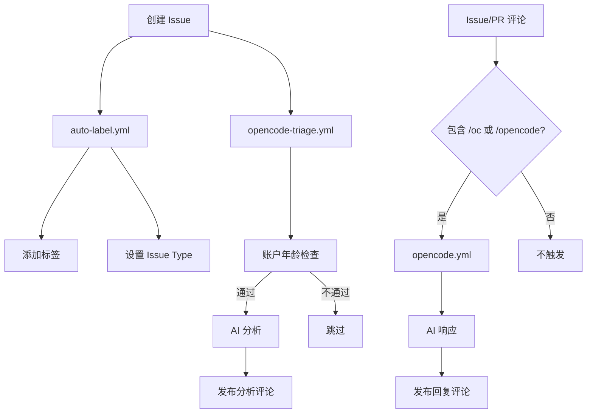

# GitHub Actions 工作流说明

本文档介绍项目中配置的 GitHub Actions 工作流，用于自动化 Issue 分类、AI 分析回复等功能。

## 工作流概览

| 工作流 | 触发条件 | 功能 |
|--------|----------|------|
| `auto-label.yml` | Issue 创建时 | 自动添加标签和类型 |
| `opencode-triage.yml` | Issue 创建时 | AI 分析并回复 |
| `opencode.yml` | Issue/PR 评论 | AI 命令响应 |

---

## 1. auto-label.yml - 自动标签分类

### 功能说明

当新 Issue 创建时，自动根据标题和内容添加标签和 Issue Type。

### 触发条件

```yaml
on:
  issues:
    types: [opened]
```

### 分类规则

#### 类型标签

| 标签 | 触发关键词 |
|------|-----------|
| `bug` | bug, 错误, 失败, crash |
| `feature` | feature, 功能, 添加, 支持 |
| `question` | question, 问题, 询问, 怎么 |
| `documentation` | doc, 文档, 说明 |

#### 模块标签

| 标签 | 触发条件 |
|------|----------|
| `module: web` | 标题包含 web 或正文包含 aiko-boot-starter-web |
| `module: orm` | 标题包含 orm 或正文包含 aiko-boot-starter-orm |
| `module: core` | 标题包含 core 或正文包含 aiko-boot |

#### 功能标签

| 标签 | 触发关键词 |
|------|-----------|
| `database` | 数据库, mysql, postgresql |
| `logging` | 日志, log |
| `configuration` | 配置, config |
| `needs-review` | 无匹配时默认添加 |

#### Issue Type 设置

| 类型 | 对应标签 |
|------|----------|
| Bug | bug |
| Feature | feature |
| Task | question |

### 示例

创建标题为 `Feature: 添加用户认证功能` 的 Issue，会自动添加：
- Labels: `feature`, `module: web`
- Type: `Feature`

---

## 2. opencode-triage.yml - Issue 自动分析

### 功能说明

当新 Issue 创建时，使用 AI（OpenCode + 通义千问）自动分析 Issue 内容并发布评论回复。

### 触发条件

```yaml
on:
  issues:
    types: [opened]
  workflow_dispatch:
    inputs:
      issue_number:
        description: 'Issue number to triage'
        required: true
        type: number
```

- **自动触发**: Issue 创建时
- **手动触发**: GitHub Actions 页面手动运行，需提供 Issue 编号

### 安全机制

工作流会检查 Issue 创建者的账户年龄，仅处理注册满 30 天以上的用户提交的 Issue，以减少垃圾信息。

### AI 模型配置

- **提供商**: 阿里云百炼
- **模型**: qwen3.5-plus
- **配置文件**: 项目根目录 `opencode.json`

### 分析内容

AI 会自动分析以下内容：

1. **Issue 类型判断** - bug/feature/question/documentation
2. **问题分析** - 分析问题原因和影响范围
3. **相关代码定位** - 查找相关代码位置
4. **解决方案建议** - 提供修复建议或实现方案
5. **标签建议** - 推荐适当的标签

### 使用示例

创建 Issue 后，AI 会自动发布分析评论：

```
## Issue 分析结果

### 📋 Issue 类型
Bug - 数据库连接失败问题

### 🔍 问题分析
...

### 📖 相关代码位置
- packages/aiko-boot-starter-orm/src/database.ts:47-94
- packages/aiko-boot-starter-orm/src/auto-configuration.ts:61-134

### ✅ 建议排查步骤
...

### 🏷️ 建议标签
bug, database, orm, needs-info
```

---

## 3. opencode.yml - 评论命令响应

### 功能说明

在 Issue 或 PR 的评论中使用 `/oc` 或 `/opencode` 命令，触发 AI 进行响应。

### 触发条件

```yaml
on:
  issue_comment:
    types: [created]
  pull_request_review_comment:
    types: [created]
```

### 命令格式

在 Issue 或 PR 评论中输入：

```
/oc 你的问题或指令
```

或

```
/opencode 你的问题或指令
```

### 常用命令示例

| 命令 | 说明 |
|------|------|
| `/oc explain this issue` | 解释这个 Issue |
| `/oc fix this` | 修复这个问题（会创建 PR） |
| `/oc review this code` | 审查代码 |
| `/oc add error handling here` | 在此处添加错误处理 |

### 使用场景

1. **Issue 中提问**
   ```
   /oc 请分析这个问题的根本原因
   ```

2. **请求修复**
   ```
   /opencode fix this bug
   ```

3. **PR 代码审查**
   ```
   /oc 检查这段代码是否有安全问题
   ```

4. **特定代码行评论**
   - 在 PR 的 Files 选项卡中对特定代码行评论
   - AI 会自动获取文件路径、行号和 diff 上下文

---

## 配置要求

### Secrets 配置

在 GitHub 仓库的 Settings → Secrets and variables → Actions 中配置：

| Secret 名称 | 说明 |
|-------------|------|
| `BAILIAN_API_KEY` | 阿里云百炼 API Key |

### 权限要求

工作流需要以下权限：

```yaml
permissions:
  id-token: write
  contents: write
  pull-requests: write
  issues: write
```

### 自定义模型配置

项目根目录的 `opencode.json` 文件配置了百炼 API：

```json
{
  "$schema": "https://opencode.ai/config.json",
  "provider": {
    "bailian": {
      "env": ["BAILIAN_API_KEY"],
      "options": {
        "baseURL": "https://dashscope.aliyuncs.com/compatible-mode/v1"
      },
      "models": {
        "qwen3.5-plus": {
          "name": "Qwen 3.5 Plus",
          "context": 131072,
          "max_output": 8192
        }
      }
    }
  }
}
```

---

## 标签列表

项目预定义的标签：

### 类型标签

| 标签 | 颜色 | 说明 |
|------|------|------|
| `bug` | 红色 | Bug 报告 |
| `feature` | 蓝色 | 功能请求 |
| `question` | 紫色 | 问题咨询 |
| `documentation` | 深蓝 | 文档相关 |

### 模块标签

| 标签 | 颜色 | 说明 |
|------|------|------|
| `module: web` | 蓝色 | Web 模块相关 |
| `module: orm` | 蓝色 | ORM 模块相关 |
| `module: core` | 蓝色 | 核心框架相关 |

### 功能标签

| 标签 | 颜色 | 说明 |
|------|------|------|
| `database` | 紫色 | 数据库相关 |
| `logging` | 粉色 | 日志相关 |
| `configuration` | 绿色 | 配置相关 |
| `needs-review` | 黄色 | 需要审查 |

---

## 工作流执行流程



---

## 常见问题

### Q: Issue 创建后没有自动添加标签？

检查以下几点：
1. 确认 `auto-label.yml` 工作流已在 main 分支
2. 检查 Actions 页面是否有错误日志
3. 确认标签已在仓库中创建

### Q: AI 分析响应很慢？

OpenCode 分析可能需要 1-5 分钟，取决于：
- Issue 内容复杂度
- 代码库大小
- 模型响应速度

如果等待时间过长，可以使用评论命令 `/oc` 快速触发响应。

### Q: 如何更换 AI 模型？

修改 `opencode.json` 和工作流文件中的 `model` 参数。支持格式：`provider/model-name`。

### Q: 如何添加新的自动分类规则？

编辑 `auto-label.yml` 中的分类逻辑，添加新的关键词匹配规则。
